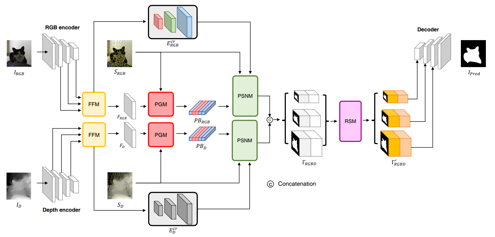
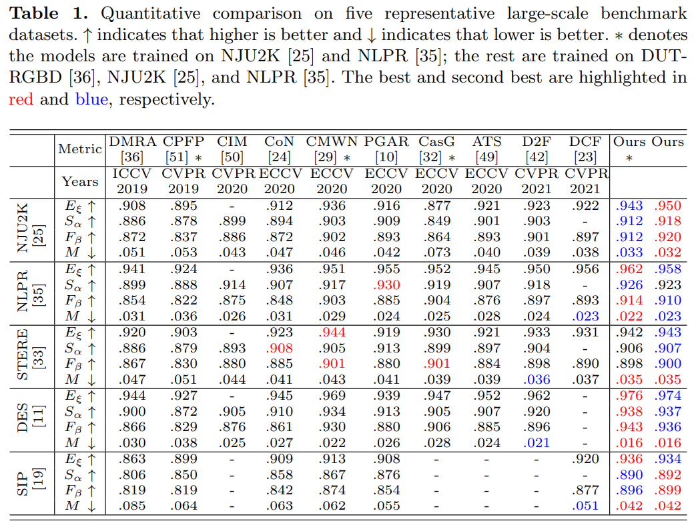
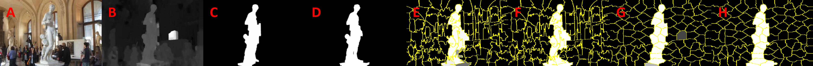

# SPSN: Superpixel Prototype Sampling Network for RGB-D Salient Object Detection (ECCV 2022)

[](https://paperswithcode.com/sota/rgb-d-salient-object-detection-on-sip?p=spsn-superpixel-prototype-sampling-network)
[](https://paperswithcode.com/sota/rgb-d-salient-object-detection-on-des?p=spsn-superpixel-prototype-sampling-network)
[](https://paperswithcode.com/sota/rgb-d-salient-object-detection-on-nju2k?p=spsn-superpixel-prototype-sampling-network)
[](https://paperswithcode.com/sota/rgb-d-salient-object-detection-on-nlpr?p=spsn-superpixel-prototype-sampling-network)
[](https://paperswithcode.com/sota/rgb-d-salient-object-detection-on-stere?p=spsn-superpixel-prototype-sampling-network)

Authors: [Minhyeok Lee](https://github.com/Hydragon516), [Chaewon Park](https://github.com/codnjsqkr), [Suhwan Cho](https://github.com/suhwan-cho), Sangyoun Lee

This repository provides code for paper "SPSN: Superpixel Prototype Sampling Network for RGB-D Salient Object Detection" accepted by the ECCV 2022 conference.

Our paper can be found [[arXiv]](https://arxiv.org/abs/2207.07898)



## Prepared Datasets
Download the train and test dataset from [Google Drive](https://drive.google.com/file/d/17Ee2l1837HkHR8EGoR4u1Be3v_qliXj0/view?usp=sharing).

## Requirements
For the superpixel algorithm we use [fast_slic](https://github.com/Algy/fast-slic). You can install it like this:
```
pip install fast_slic
```

## Training Model
1. First, clone this repository.
```
git clone https://github.com/Hydragon516/SPSN
```
2. Edit config.py. The data root path option and GPU index should be modified.
3. Train the model.
```
python3 train.py
```

## Evaluation
When training is complete, the prediction results for the test set are saved in the ./log folder. Two popular evaluation toolboxes are available. (Matlab version: https://github.com/DengPingFan/CODToolbox Python version: https://github.com/lartpang/PySODMetrics)

## Result


./log directory structure
```
.
├── root
└── log/
    └── 2022-xx-xx xx:xx:xx/
        ├── model/
        │   └── best_model.pth
        ├── result/
        │   ├── gt/        # ground truth images
        │   │   ├── NJU2K
        │   │   ├── NLPR
        │   │   ├── DES
        │   │   ├── SIP
        │   │   └── STERE
        │   ├── pred/      # predicted mask images (only mask)
        │   │   ├── NJU2K
        │   │   ├── NLPR
        │   │   ├── DES
        │   │   ├── SIP
        │   │   └── STERE
        │   └── total/     # includes RGB, depth, GT, superpixel sampling maps, prediction mask, and more
        │       ├── NJU2K
        │       ├── NLPR
        │       ├── DES
        │       ├── SIP
        │       └── STERE
        └── train/
            └── config.py
```

An example of the resulting image is shown below.



* A : RGB image
* B : Depth map
* C : Pred map
* D : GT
* E : Pred superpixel map from RGB
* F : GT superpixel map from RGB
* G : Pred superpixel map from depth
* H : GT superpixel map from depth

The prediction mask results of our proposed model can be found [here](https://drive.google.com/file/d/1QjgsNz7S21yNIbCsUW3zINmivxXr6vK0/view?usp=sharing).

## Citation
```
@article{lee2022spsn,
  title={SPSN: Superpixel Prototype Sampling Network for RGB-D Salient Object Detection},
  author={Lee, Minhyeok and Park, Chaewon and Cho, Suhwan and Lee, Sangyoun},
  journal={arXiv preprint arXiv:2207.07898},
  year={2022}
}
```

## Star History

[](https://star-history.com/#Hydragon516/SPSN&Date)
